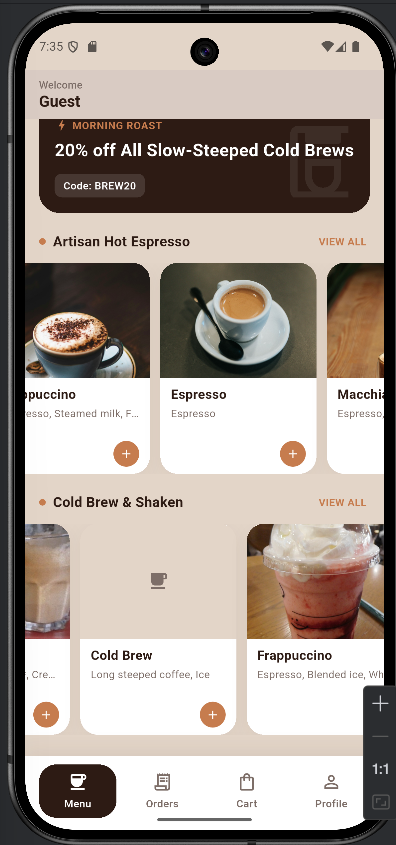
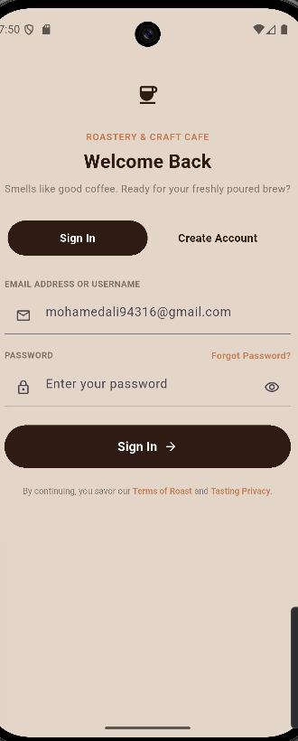

# ☕ Cafe App

A Flutter mobile app for browsing and ordering coffee, built with a clean feature-first architecture, Firebase Authentication, and a public REST API for menu data.

## 📱 Screenshots


| Menu |
|------|
| Welcome header, promo banner, horizontally scrollable "Hot" and "Cold" item sections, bottom navigation |

## ✨ Features

### ✅ Completed
- **Authentication** — Email/password sign-up (with email verification) and login via Firebase Auth.
- **Menu**
    - Fetches hot and cold coffee items from a REST API (`https://api.sampleapis.com/coffee/iced`) using Dio.
    - Separate Cubits for hot and cold item lists with loading / error / success states.
    - Horizontally scrollable item cards with quantity controls (increment/decrement).
    - Item details dialog on tap.
    - **Search** — dedicated search screen that filters already-loaded hot and cold items by title or ingredients, with a grid results view and empty-state handling.
- **Navigation** — Custom animated bottom navigation bar (Menu, Orders, Cart, Profile) backed by an `IndexedStack` to preserve state across tabs.

### 🚧 In Progress
- **Orders** — order history / tracking screen (placeholder).
- **Cart** — shopping cart screen (placeholder).
- **Profile** — user profile / account management screen (placeholder).

## 🏗️ Architecture

The project follows a **feature-first** folder structure, with each feature organized into `data` and `presentation` layers:


## 🛠️ Tech Stack

| Category | Package / Tool |
|---|---|
| Framework | Flutter |
| State Management | `flutter_bloc` (Cubit) |
| Networking | `dio` |
| Authentication | `firebase_auth` |
| API | [sampleapis.com/coffee](https://api.sampleapis.com/coffee) |

## 🔄 App Flow

1. `AuthGate` listens to `AuthCubit` and shows a loading indicator, `AuthScreen`, or `NavigationScreen` depending on auth state.
2. Once authenticated, `NavigationScreen` renders the bottom tab bar and keeps all four tab screens alive via `IndexedStack`.
3. `MenuScreen` initializes two `ItemsCubit` instances (hot & cold) on `initState`, each fetching its category from the API.
4. Tapping the search bar opens `SearchScreen`, passing along the already-fetched hot/cold item lists for local filtering — no extra network calls.

## 🚀 Getting Started

### Prerequisites
- Flutter SDK installed
- A Firebase project with Authentication (Email/Password) enabled
- `google-services.json` (Android) / `GoogleService-Info.plist` (iOS) added to the project

### Setup
```bash
git clone <https://github.com/Mohamed-Soliman943/cafe.git>
cd cafe
flutter pub get
flutter run
```

